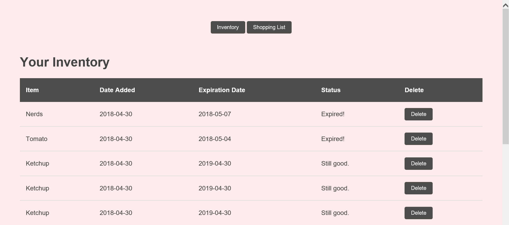
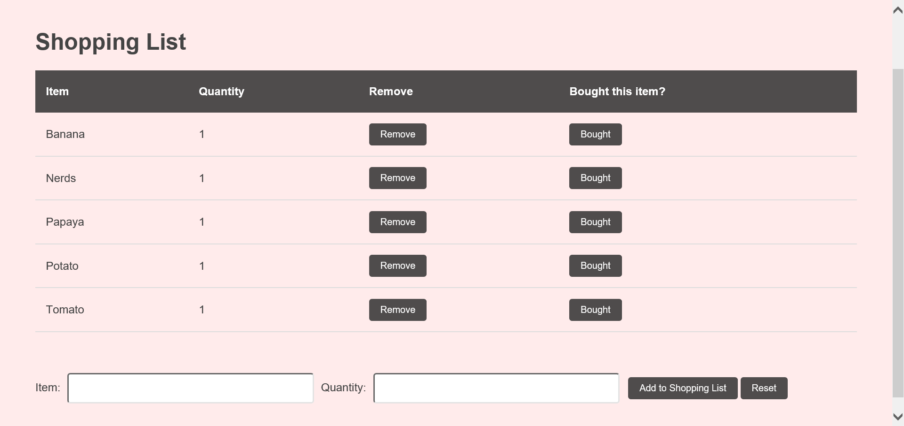

For my final project for ICS 321 (Intro to Databases), I developed a simple database-backed app using Java and the Glassfish framework. My app is called Pantry and its functionality is to serve as a very straightforward inventory and shopping list (2 in 1!) app. The general idea for the app was the shopping list and inventory go hand in hand, to minimize the amount of data the user has to input (since that can often be a hassle and discourage users from using an app.) For example, the inventory keeps track of all food and grocery items that you own, along with their expiration dates. As soon as an item expires, it automatically gets added to your shopping list, giving the user the option to remove it should they not want to buy it, and saving them the trouble of inputting it themselves should they decide that they need it. Furthermore, all items that you mark as <i>bought</i> on your shopping list are automatically added to your inventory, with their expiration dates automatically set according to a database full of food expiration dates. With this functionality, all the user needs to do is simply create a shopping list by entering the names and quantities of items that they need to buy, mark them as <i>bought</i> after they've been purchased, and the app takes care of the rest.

Another idea I recently had for the improvement of this app was to incorporate recipes into the databases, which would allow users to add all ingredients for a recipe and their respective quantities to their shopping list rather than individual ingredients. This would further simplify the process of creating the shopping list.

Click <a href="https://youtu.be/V6tlBIqKXPA">here</a> to see a video further explaining my app.

