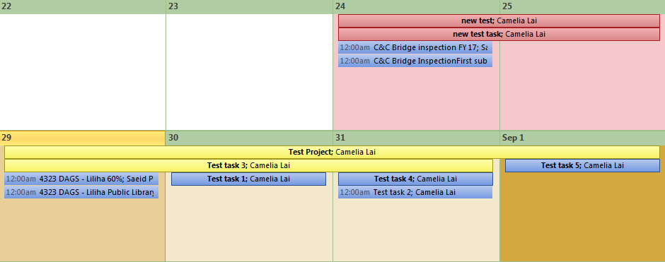
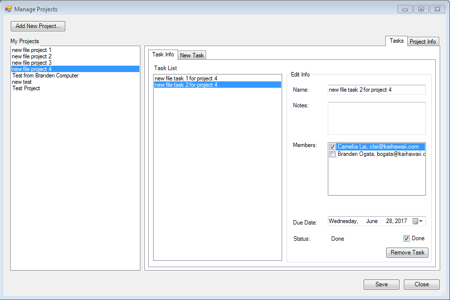

For my internship at Kai Hawaii, I developed a Microsoft Outlook add-in to help engineers more conveniently manage their engineering projects in their Outlook inboxes. The goal of this project was to create a project management tool similar to Asana, but integrated into the employees' Microsoft Outlook inboxes for convenience and ease of use. I am still adding more functionalities to my add-in, but so far, users can add tasks and projects to a public calendar visible to the company, add other employees to their projects and tasks, check the statuses of their projects and tasks, and recieve automatic email reminders of upcoming due dates.

Currently, I am working with my teammate to expand the add-in's capabilities of syncing project information with multiple employees on a shared project. Our approach to this consists of storing project and task data externally via XML, and uploading project data from each individual user to a masterfile on the server whenever changes are made. The add-in would periodically read the masterfile for any changes, and update the calendar and project information accordingly.
