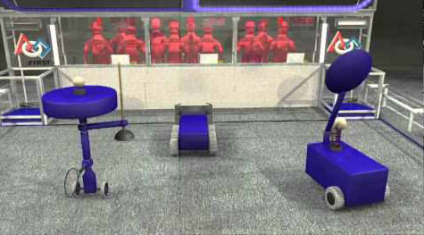

When I was the lead programmer on the Kalani Robotics Team back in high school, one of my hardest projects was to program the vision processing and target detection capabilities for our FIRST Robotics Competition (FRC) robot. Every year, the FRC season features a different game, each with its own autonomous challenge which usually involves vision processing or goal detection using a camera on the robot. During the first 15 seconds of each match, the robot has a chance to score as many points as it can while functioning completely autonomously. After the first 15 seconds, the robot driver takes control and scores the rest of the points. However, the points scored autonomously are worth more than points scored by the driver, so the teams with high-scoring autonomous programs were ranked significantly higher and put at an advantage.

In 2014, the competition game was Aerial Assist, a game where robots would have to shoot exercise balls into goals to earn points for their teams. During the fifteen second autonomous period for each match, a randomly chosen goal (either the right side, left side, or both) would light up at a random time and turn "hot". Any scores made in a goal that was "hot" were worth a significant amount of bonus points. To help the robots detect when a goal was "hot", a rectangular retroreflective flap would flip outwards whenever the goal turned "hot" so that the robot cameras would be able to detect the light reflected off of the retroreflective tape, coming from the LEDs attached to the cameras. In the picture, the goal on the right side would be considered "hot".

My job for that season as the lead programmer for the team was to write a "hot detecting" autonomous program, where the robot would ideally detect when the goal became "hot" as soon as the retroreflective flap appeared in the camera's view (the camera would detect it as a bright green rectangle of light), and launch a preloaded ball into the "hot" goal. This involved programming the robot to 1) look for the bright green rectangle, and 2) use the aspect ratio of the rectangle to position itself at the correct distance from the goal such that the ball would actually land in the goal. Fortunately, many of the complicated algorithms and functions were provided in the robotics LabVIEW library, but I was still responsibile for integrating the code into our autonomous program and modifying it for the camera type, viewing angle, and shooting strength (to calculate distance required) specific to our robot.

You can learn more about the Aerial Assist game [here](https://www.youtube.com/watch?v=f5zWzICG5to&amp=&feature=c4-overview&amp=&list=UUHA7zyPRS3VPDvl4ehss-zw).

